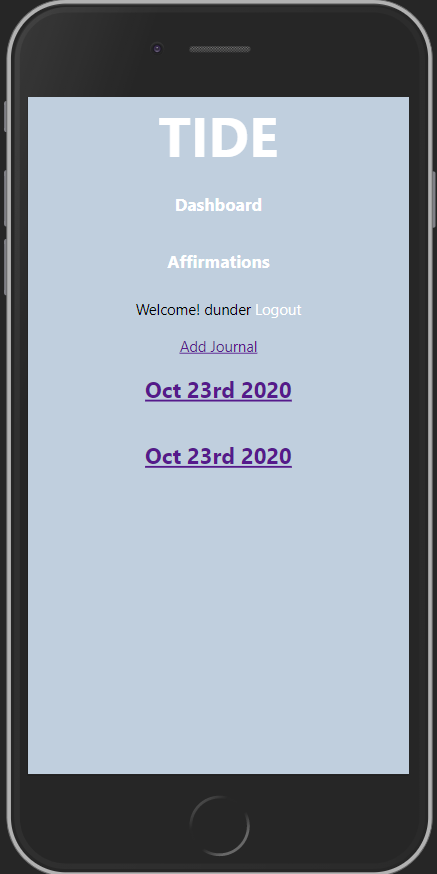

# TIDE
Tide is a mobile first web app designed to act as a digital journal and self-help resource to those who don't have access to mental healthcare 
Check out [Tide](https://tide-capstone.vercel.app/)

## Summary
Users can create accounts, log journal entries to their own personal journal, create and post affirmations that other users can then comment on. Users who are not registered can login to a demo account to see how the app works before signing up for an account. This app uses the Tide API to handle HTTP requests. see the documentation for the API here: [Tide API](https://github.com/HannahCheyenne/capstone1-server)

## App Screens
The app has 9 main page views. The components for each page view are found in the routes directory. Smaller components that are part of each screen, both unique and reused, are found in the components directory.

### Landing Page
The landing page gives new users a brief description of the app and its purpose. 
<em></em>

### Login Page
From the Landing Page users can view the Login Page. Already registered users can log in here. New users can click the link to create an account. A demo user account is also available to allow new users to try out the app as well. 
<em></em>

### Registration Page
The registration page is for new users to create an account. If you already have an account, you can click on a link that will redirect you to the login page. 
<em></em>

### Dashboard/Journal List Page
The dashboard page is also where your list of journal entries live that only you can see. You can click on an individual journal to view that entry. 
<em></em>

### Individual Journal Page
The individual journal page lets you view the content for that journal entry. 
<em></em>

### Create a new Journal Entry Page
This page allows you to create a new journal entry to log in your personal journal. 
<em></em>

### Affirmation List Page
The Affirmations list page displays a list of affirmations, the date posted, the user, and the number of comments. You can click on an individual affirmation to view the content and comments. 
<em></em>

### Individual Affirmation Page
This page allows you to view the content and comments of a selected affirmation and also allows you to post comments. 
<em></em>

### Create a new Affimation Page
This page allows you to create a new affirmation to post for other users to view. 
<em></em>

## Stack
Create-React-App was used to bootstrap the project.
React Router(DOM) was used to handle navigation through page views.
ReactFontAwesome was used to display various svg icons throughout the app.
Testing used the Jest test framework.
